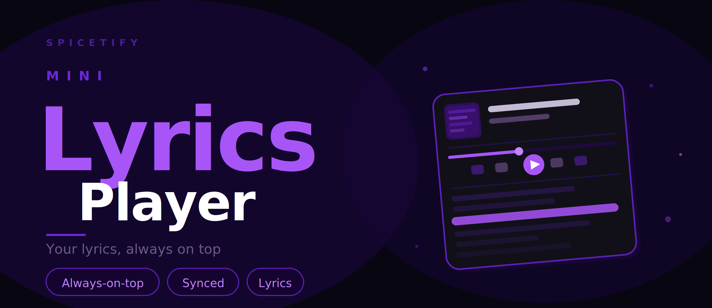
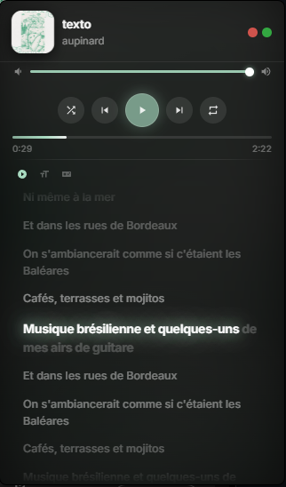

# 🎵 PIP-Lyric-Player. V.1.0



A floating Picture-in-Picture lyrics window for Spotify - always on top, synchronized, with word-by-word karaoke animation.



---

## ✨ Features

- **Floating PiP window** - stays above all your other windows, draggable anywhere on screen
- **Word-by-word sync** - each word lights up as it's sung, interpolated from Spotify's line timestamps
- **Dynamic accent color** - background and glow automatically adapt to the album art
- **Full playback controls** - play/pause, previous/next, shuffle, repeat, like, volume slider, seekbar
- **Gaming Mode** - hides the cursor and disables all mouse interactions on the window so it never interferes with your game
- **Auto-scroll** - active lyric line stays centered automatically
- **Adjustable font size** - cycle through 4 sizes with one click
- **Remaining/elapsed time** - click the timestamp to toggle
- **Collapsible** - collapse to a mini player showing only track info

---

## 📦 Installation

### Via Spicetify Marketplace *(recommended)*
1. Open Spotify with Spicetify installed
2. Click **Marketplace** in the sidebar
3. Search for **Mini Lyrics Player**
4. Click **Install**

### Manual
1. Download `lyrics.js`
2. Copy it to your Spicetify extensions folder:
   - **Windows:** `%APPDATA%\spicetify\Extensions\`
   - **macOS / Linux:** `~/.config/spicetify/Extensions/`
3. Run:
```bash
spicetify config extensions lyrics.js
spicetify apply
```

---

## 🎮 Gaming Mode (BETA)

Click the **🎮 controller icon** in the lyrics toolbar to enable Gaming Mode.

When active:
- The mouse cursor disappears over the PiP window
- All clicks pass through (no accidental lyric seeking or button presses)
- The window never steals focus from your game

Click the controller icon again to disable it.

---

## ⌨️ Keyboard Shortcuts

These shortcuts work when the PiP window is focused.

| Key | Action |
|-----|--------|
| `Space` | Play / Pause |
| `←` / `→` | Seek −5s / +5s |
| `Ctrl + ←` / `→` | Previous / Next track |
| `↑` / `↓` | Volume +5% / −5% |
| `L` | Like / Unlike |
| `S` | Toggle Shuffle |
| `R` | Toggle Repeat |

---

## 🛠️ Requirements

- [Spicetify](https://spicetify.app) v2.x or later
- Spotify desktop client

---

Original Code : https://github.com/FO-SS/Spictify-Lyric-Miniplayer

## 📄 License

MIT
